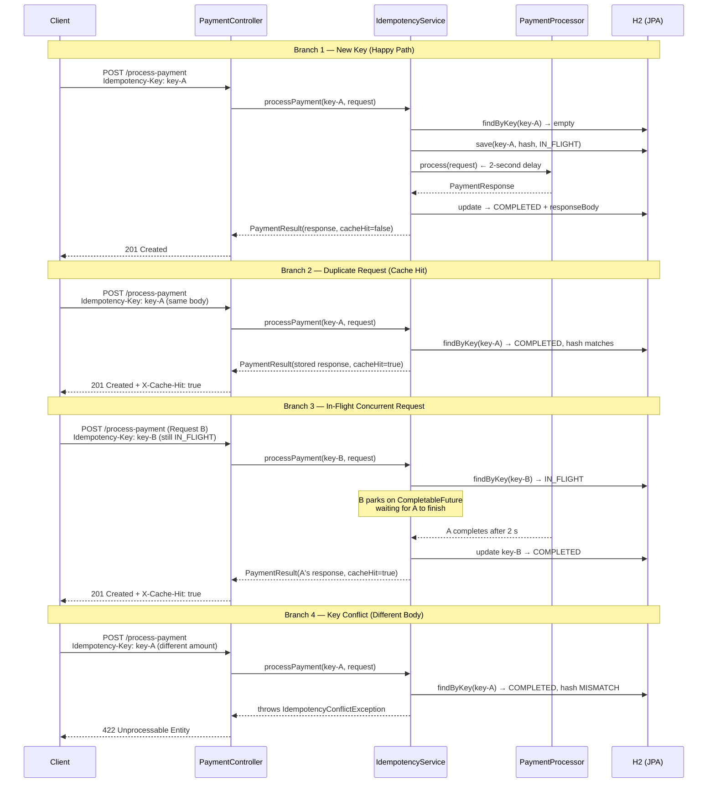

# Idempotency Gateway — IgirePay Technologies

A Spring Boot REST API that implements a production-grade idempotency layer to prevent double-charging in payment systems. Every `POST /process-payment` request carries a unique `Idempotency-Key`; network retries, replay attacks, and concurrent race conditions all collapse to a single charged transaction.

---

## Architecture



---

## Setup

### Prerequisites

- **JDK 17** (or later)
- No database installation required — H2 runs in-memory automatically

### Run the server

```bash
# Unix / macOS
./mvnw spring-boot:run

# Windows
mvnw.cmd spring-boot:run
```

The server starts on **http://localhost:8080**.

H2 console (inspect live data): **http://localhost:8080/h2-console**
- JDBC URL: `jdbc:h2:mem:idempotencydb`
- Username: `sa` / Password: *(leave blank)*

---

## API Documentation

### `POST /process-payment`

#### Headers

| Header            | Required | Description                                        |
|-------------------|----------|----------------------------------------------------|
| `Idempotency-Key` | **Yes**  | Unique string per logical payment (UUID recommended) |
| `Content-Type`    | **Yes**  | `application/json`                                 |

#### Request body

```json
{
  "amount": 100,
  "currency": "RWF"
}
```

| Field      | Type   | Constraints           |
|------------|--------|-----------------------|
| `amount`   | number | Required, must be > 0 |
| `currency` | string | Required, non-blank   |

#### Response codes

| Code                              | When                                                         |
|-----------------------------------|--------------------------------------------------------------|
| `201 Created`                     | Payment processed successfully for the first time           |
| `201 Created` + `X-Cache-Hit: true` | Duplicate key — stored response replayed immediately       |
| `400 Bad Request`                 | Missing `Idempotency-Key` header or invalid request body    |
| `422 Unprocessable Entity`        | Same key reused with a different request body               |
| `500 Internal Server Error`       | Unexpected server error                                     |

#### Success response body

```json
{
  "status": "Charged 100 RWF",
  "idempotencyKey": "my-unique-key-123",
  "transactionId": "f47ac10b-58cc-4372-a567-0e02b2c3d479"
}
```

#### Error response body

```json
{
  "error": "Idempotency key already used for a different request body."
}
```

---

### curl Examples

**Happy path — first payment**
```bash
curl -i -X POST http://localhost:8080/process-payment \
  -H "Content-Type: application/json" \
  -H "Idempotency-Key: key-001" \
  -d '{"amount": 100, "currency": "RWF"}'
```

**Duplicate request — cached replay**
```bash
# First call (takes ~2 s, processes payment)
curl -X POST http://localhost:8080/process-payment \
  -H "Content-Type: application/json" \
  -H "Idempotency-Key: key-001" \
  -d '{"amount": 100, "currency": "RWF"}'

# Second call with same key+body — instant response, X-Cache-Hit: true
curl -i -X POST http://localhost:8080/process-payment \
  -H "Content-Type: application/json" \
  -H "Idempotency-Key: key-001" \
  -d '{"amount": 100, "currency": "RWF"}'
```

**Key conflict — different body → 422**
```bash
curl -i -X POST http://localhost:8080/process-payment \
  -H "Content-Type: application/json" \
  -H "Idempotency-Key: key-001" \
  -d '{"amount": 500, "currency": "RWF"}'
```

**Missing header → 400**
```bash
curl -i -X POST http://localhost:8080/process-payment \
  -H "Content-Type: application/json" \
  -d '{"amount": 100, "currency": "RWF"}'
```

---

## Design Decisions

### H2 In-Memory Database
Zero-config persistence. The server starts immediately with `./mvnw spring-boot:run` from a fresh clone — no database installation, migration scripts, or environment variables required. Swapping to PostgreSQL or MySQL requires only a `spring.datasource` change in `application.yml`.

### Per-Key Locks via `ConcurrentHashMap<String, CompletableFuture<PaymentResponse>>`
A global lock would serialize every request through a single bottleneck. A per-key `CompletableFuture` map lets requests for *different* keys run fully in parallel while still coordinating concurrent duplicates for the *same* key. `ConcurrentHashMap.putIfAbsent` is the single atomic synchronization point — the thread that wins becomes the owner and processes the payment; all losers park on the owner's future and receive its result when it completes.

### SHA-256 of Canonical JSON
Raw-string body comparison breaks when whitespace or field order differs between retries (common across client libraries). The implementation sorts fields alphabetically via `TreeMap`, normalizes `BigDecimal` amounts with `stripTrailingZeros()`, then SHA-256 hashes the result. `{"amount":100,"currency":"RWF"}` and `{"currency":"RWF","amount":100}` are treated as identical.

### Full Response Stored as Serialized JSON
Storing the complete serialized `PaymentResponse` (not just a status code or `transactionId`) means we return the **exact same bytes** on a cache hit, including every field. Re-computing the response from stored fields risks subtle divergence if the schema changes between deploys.

---

## Developer's Choice: Idempotency-Key TTL with Automatic Expiry

Keys expire **24 hours** after creation. A Spring `@Scheduled` sweeper runs **every 10 minutes** to purge expired records from H2.

**Why it matters for fintech:**

1. **Prevents unbounded storage growth** — a production payments system handling thousands of transactions per day accumulates millions of stale keys without a cleanup mechanism.
2. **Matches Stripe's real-world behavior** — Stripe expires idempotency keys after 24 hours; clients generating keys from order IDs can safely reuse them after the window closes.
3. **Aligns with reconciliation windows** — most payment processors reconcile within 24 hours; retaining idempotency records longer offers no safety benefit.

Both the TTL and sweeper schedule are **configurable** in `application.yml`:

```yaml
idempotency:
  ttl-hours: 24                      # how long a key is retained
  cleanup-cron: "0 */10 * * * *"    # sweeper runs every 10 minutes
```

---

## Running Tests

```bash
./mvnw test          # Unix / macOS
mvnw.cmd test        # Windows
```

| Test | Scenario |
|------|----------|
| `happyPath_returns201WithCorrectBody` | 201 + `"Charged N CURRENCY"` status |
| `duplicateRequest_returnsCachedResponse_withCacheHitHeader_quickly` | Instant replay, `X-Cache-Hit: true`, same `transactionId`, < 500 ms |
| `differentBodySameKey_returns422WithExactMessage` | 422 with exact required error string |
| `missingIdempotencyKey_returns400` | 400 with descriptive message |
| `concurrentIdenticalRequests_bothSucceed_sameTransactionId_secondIsCacheHit` | Both 201, same `transactionId`, second has `X-Cache-Hit: true` |
| `expiredKey_isPurged_andBehavesAsNewRequest` | Purged key accepts a fresh request without `X-Cache-Hit` |

